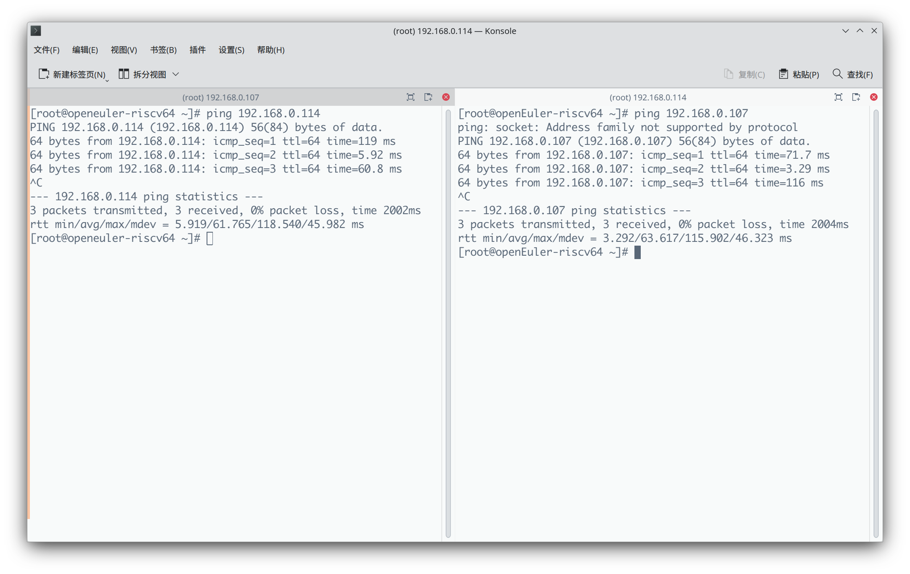
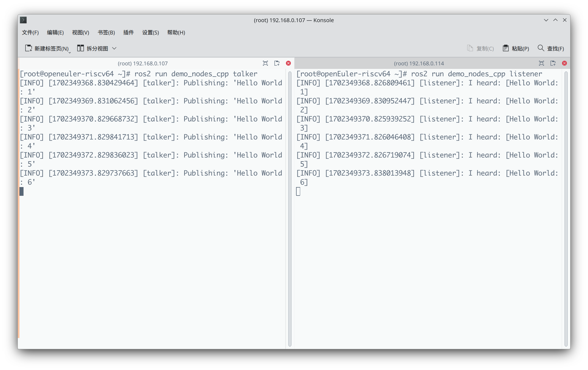
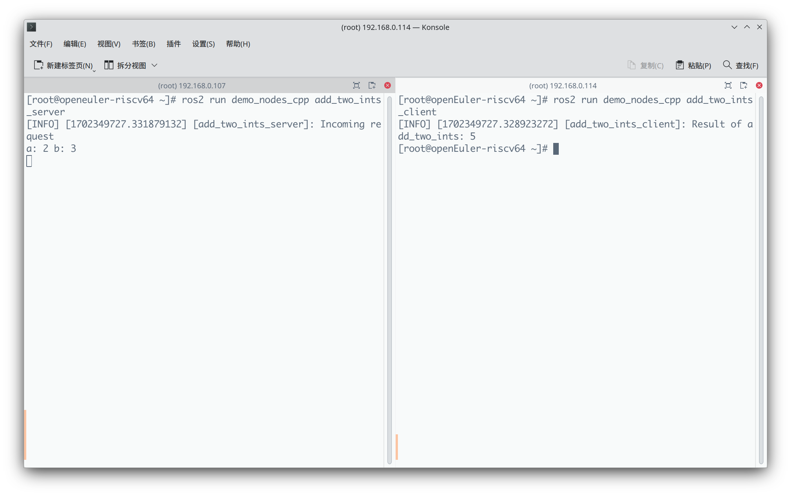
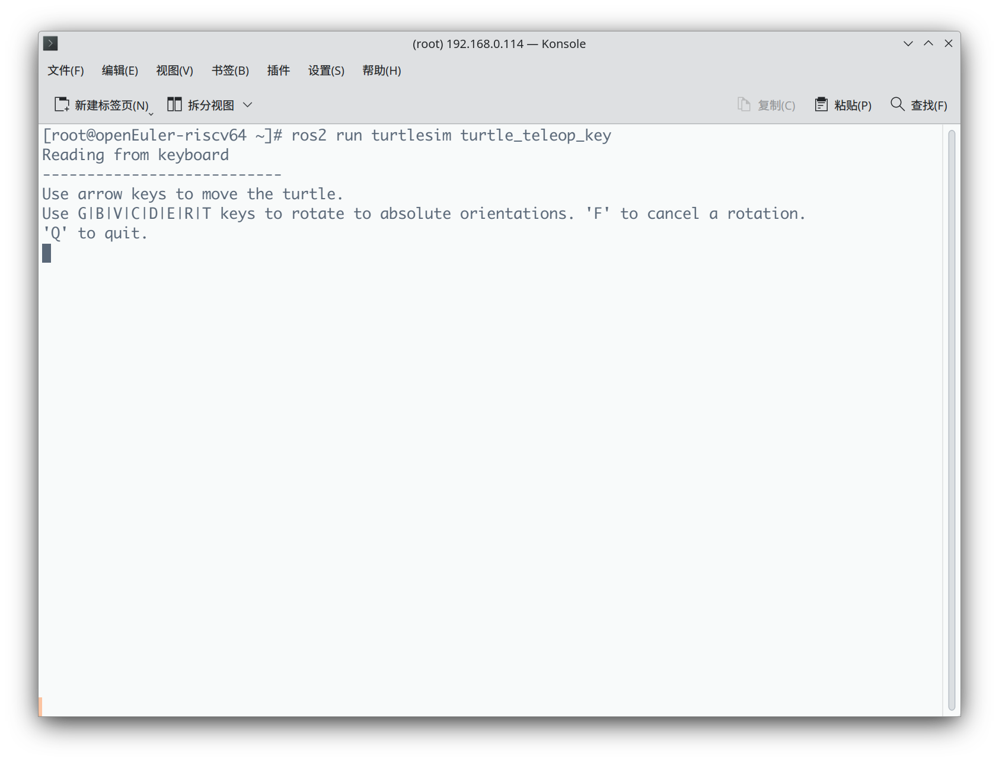
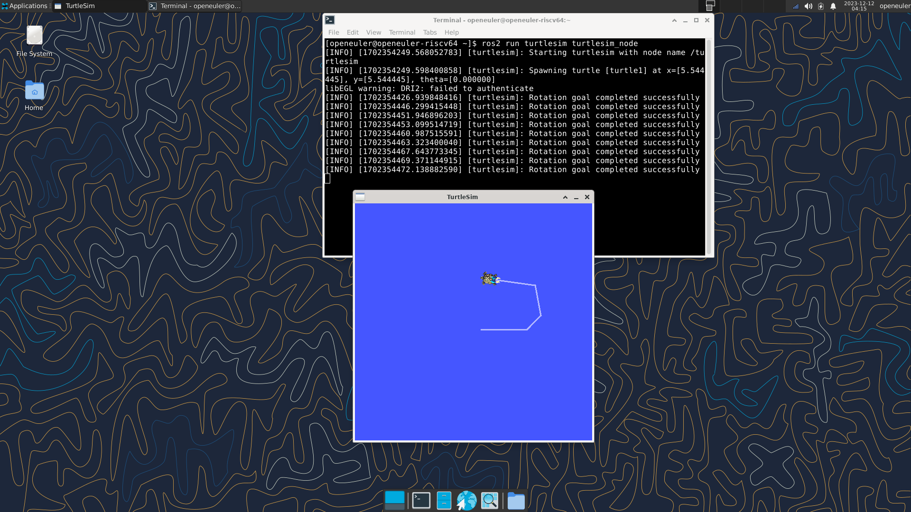
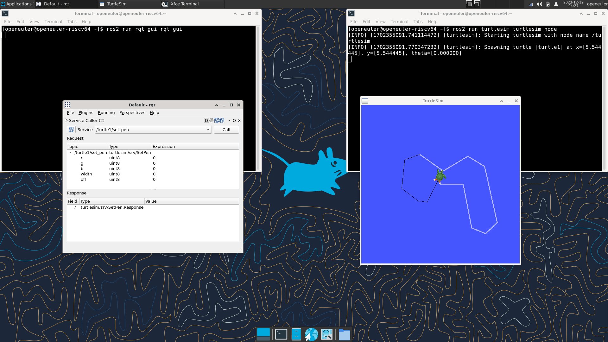

# 实战：多机通信实例


## 准备工作

完成本 demo 需要 openEuler risc-v 23.09 或 22.03 支持的环境以及对应的镜像。

相关内容参见：

- 22.03: https://mirror.iscas.ac.cn/openeuler-sig-riscv/openEuler-RISC-V/preview/openEuler-22.03-V2-riscv64/
- 23.09: https://mirror.iscas.ac.cn/openeuler-sig-riscv/openEuler-RISC-V/preview/openEuler-23.09-V1-riscv64/

以下为本示例选取的一种环境，您可以根据上述选取合适的环境。


## 环境信息

### 硬件信息

本示例使用到的硬件为：

1. LicheePi 4A 处理器 TH1520 内存 16GB
2. Visionfive 2 处理器 JH7110 内存 4GB


### 软件信息

本示例中 LicheePi 4A 刷写的镜像为 openEuler-23.09，Visionfive 2 刷写的镜像为 openEuler-22.03

##### LicheePi 4A

1. OS 版本：openEuler-23.09-V1-xfce-lpi4a
2. 镜像地址：[https://mirror.iscas.ac.cn/openeuler-sig-riscv/openEuler-RISC-V/preview/openEuler-23.09-V1-riscv64/lpi4a/](https://mirror.iscas.ac.cn/openeuler-sig-riscv/openEuler-RISC-V/preview/openEuler-23.09-V1-riscv64/lpi4a/)
3. 软件源：[https://mirror.iscas.ac.cn/openeuler-sig-riscv/openEuler-RISC-V/preview/openEuler-23.09-V1-riscv64/repo/](https://mirror.iscas.ac.cn/openeuler-sig-riscv/openEuler-RISC-V/preview/openEuler-23.09-V1-riscv64/repo/)

##### Visionfive 2

1. OS 版本：openEuler-22.03-V2-xfce-visionfive2-preview
2. 镜像地址：[https://mirror.iscas.ac.cn/openeuler-sig-riscv/openEuler-RISC-V/preview/openEuler-22.03-V2-riscv64/Visionfive2/openEuler-22.03-V2-xfce-visionfive2-preview.img.tar.zst](https://gitee.com/link?target=https%3A%2F%2Fmirror.iscas.ac.cn%2Fopeneuler-sig-riscv%2FopenEuler-RISC-V%2Fpreview%2FopenEuler-22.03-V2-riscv64%2FVisionfive2%2FopenEuler-22.03-V2-xfce-visionfive2-preview.img.tar.zst)
3. 软件源：[https://mirror.iscas.ac.cn/openeuler-sig-riscv/openEuler-RISC-V/preview/openEuler-22.03-V2-riscv64/repo](https://gitee.com/link?target=https%3A%2F%2Fmirror.iscas.ac.cn%2Fopeneuler-sig-riscv%2FopenEuler-RISC-V%2Fpreview%2FopenEuler-22.03-V2-riscv64%2Frepo)


## 刷写镜像并启动

##### LicheePi 4A

参考官方[烧录镜像](https://gitee.com/link?target=https%3A%2F%2Fwiki.sipeed.com%2Fhardware%2Fzh%2Flichee%2Fth1520%2Flpi4a%2F4_burn_image.html)教程，刷写成功后即可启动，openEuler 系统初始用户名：root/openeuler 密码：openEuler12#$。

##### Visionfive 2

openEuler 22.03 对固件版本没有明确的要求，如果确定有固件问题请按照[官方文档](https://gitee.com/link?target=https%3A%2F%2Fdoc.rvspace.org%2FVisionFive2%2FQuick_Start_Guide%2FVisionFive2_SDK_QSG%2Fupdating_spl_and_u_boot%20-%20vf2.html)更新 SPL 和 U-Boot ，[启动模式](https://gitee.com/link?target=https%3A%2F%2Fdoc.rvspace.org%2FVisionFive2%2FQuick_Start_Guide%2FVisionFive2_SDK_QSG%2Fboot_mode_settings.html)应拨至 1-bit QSPI Nor Flash。

提前下载镜像压缩包 openEuler-22.03-V2-xfce-visionfive2-preview.img.tar.zst 后用 `dd` 命令写入 SD 卡，注意目标设备一定不能写错，这里假设为 `/dev/sda

```bash
wget https://mirror.iscas.ac.cn/openeuler-sig-riscv/openEuler-RISC-V/preview/openEuler-22.03-V2-riscv64/Visionfive2/openEuler-22.03-V2-xfce-visionfive2-preview.img.tar.zst
zstd -d openEuler-22.03-V2-xfce-visionfive2-preview.img.tar.zst
tar xvf openEuler-22.03-V2-xfce-visionfive2-preview.img.tar
sudo dd if=openEuler-22.03-V2-xfce-visionfive2-preview.img of=/dev/sda bs=1M status=progress
sudo sync
```

刷写成功后即可启动，openEuler 系统初始用户名：root/openeuler 密码：openEuler12#$。如遇问题，请查阅 [Visionfive2 参考手册](https://doc.rvspace.org/VisionFive2/Quick_Start_Guide/index.html)。


## 安装 ROS 相关软件包

### 修改软件源

目前 ROS humble 在 openEuler risc-v 23.09 和 22.03 的软件源分别在：

- 22.03: http://build-repo.tarsier-infra.com/home:/Z572:/ros/openEuler_22.03_22.03/
- 23.09: http://build-repo.tarsier-infra.com/openEuler:/ROS/23.09/

LicheePi 4A 使用的镜像为 oERV 23.09 ，执行以下命令添加软件源：

```bash
bash -c 'cat << EOF > /etc/yum.repos.d/ROS.repo
[openEulerROS-humble]
name=openEulerROS-humble
baseurl=http://build-repo.tarsier-infra.com/openEuler:/ROS/23.09/
enabled=1
gpgcheck=0
EOF'
```

Visionfive 2 使用的镜像为 oERV 22.03 ，执行以下命令添加软件源： 

```bash
bash -c 'cat << EOF > /etc/yum.repos.d/ROS.repo
[openEulerROS-humble]
name=openEulerROS-humble
baseurl=http://build-repo.tarsier-infra.com/home:/Z572:/ros/openEuler_22.03_22.03/
enabled=1
gpgcheck=0
EOF'
```


### 安装

分别在两台设备中执行以下命令，安装本示例所需的软件包：

```bash
dnf install ros-humble-ros-base ros-humble-demo-nodes-cpp ros-humble-turtlesim
```


## 双机通信

进行双机通信示例前，请确保两台设备在同一局域网下，可以彼此 ping 通。

其中 LicheePi 4A IP 地址为 192.168.0.107，Visionfive 2 IP 地址为 192.168.0.114 。



### 双机 topic 通信

在一台设备执行 `ros2 run demo_nodes_cpp talker` ，在另一台设备执行 `ros2 run demo_nodes_cpp listener`。

- `talker` 节点通过 ROS 2 的发布者发布带有计数器的字符串消息到 `chatter` 主题。
- `listener` 节点通过 ROS 2 的订阅者订阅 `chatter` 主题，并在接收到消息时执行回调函数，打印消息内容。



### 双机 service 通信

在一台设备执行 `ros2 run demo_nodes_cpp add_two_ints_server` ，在另一台设备执行 `ros2 run demo_nodes_cpp add_two_ints_client`。

- `add_two_ints_server` 节点通过 ROS 2 的服务提供加法服务，它会在收到请求时执行加法操作，并将结果发送回客户端。
- `add_two_ints_client` 节点通过 ROS 2 的服务客户端向 `add_two_ints_server` 发送服务请求，等待并接收服务端的响应，最后打印出加法的结果。



### turtlesim

turtlesim 提供了一个图形用户界面，显示了一个模拟的海龟机器人和其轨迹。这使得 ROS 的消息传递和服务调用更加直观和可视化。

在一台设备执行 `ros2 run turtlesim turtlesim_node` ，可见图形界面弹出。在另一台设备执行 `ros2 run turtlesim turtle_teleop_key`，通过键盘的上下左右可以控制小乌龟的运动。






#### rqt 改变画笔颜色

在运行 turtlesim 图形界面的设备上打开一个新终端，执行 `ros2 run rqt_gui rqt_gui`

通过 Pluguis > Services > Service Caller 添加界面

service 中选择 /turtle1/set_pen 并点击 Call，然后在另一台设备利用键盘在终端移动小海龟时，其走过的路径为黑色。



## 总结

以上就是运行的 ROS 双机通信的一个简单的例子了，有兴趣的小伙伴可以将上一篇中的 service 通信中的 server 和 client 分别跑在不同的硬件或虚拟机上，体验一下 ROS 双机通信的使用，当然首先要保证两台设备或虚拟机能够互相 ping 通。