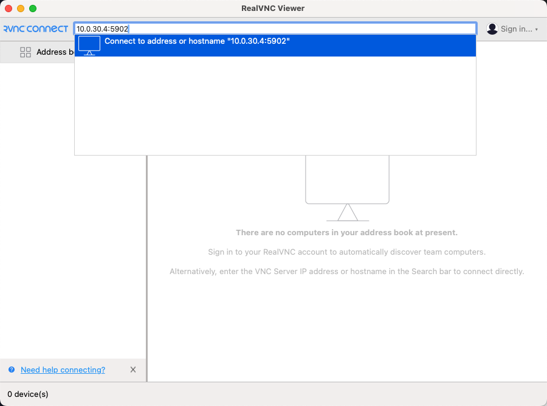
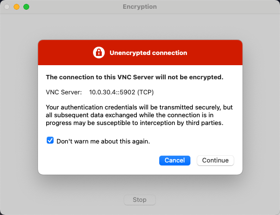
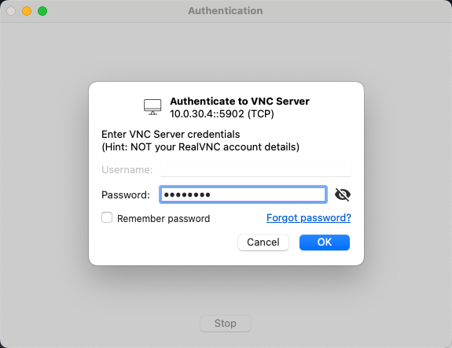
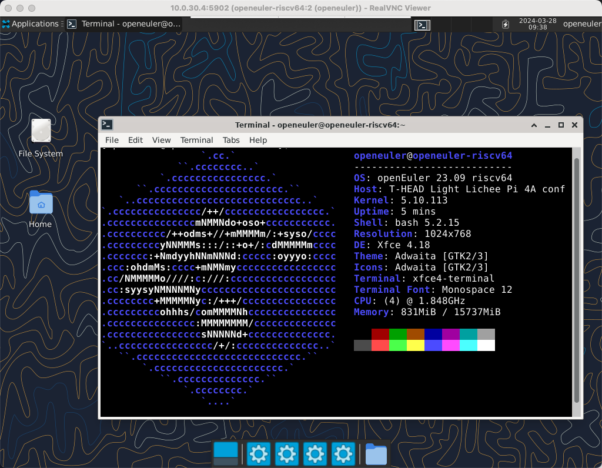

# 实战：VNC 配置与使用

VNC（Virtual Network Computing）是常用屏幕画面分享及远程操作软件之一。此软件借由网络，可发送键盘与鼠标的动作及即时的屏幕画面。

以下通过在 openEuler RISC-V 上搭建 VNC 服务端，并通过其它电脑上的 VNC 客户端连接。

## 准备工作

本示例使用到的硬件为 LicheePi 4A 处理器 TH1520 内存 16GB。

完成本内容需要 openEuler RISC-V 支持的环境以及对应的镜像，这里以 23.09 版本为例。

相关内容参见：

- 23.09: https://mirror.iscas.ac.cn/openeuler-sig-riscv/openEuler-RISC-V/preview/openEuler-23.09-V1-riscv64/

本示例使用的 VNC 客户端为 RealVNC Viewer，可以[在 RealVNC 官网](https://www.realvnc.com/en/connect/download/viewer/)下载。

## 刷写镜像并启动

参考官方[烧录镜像](https://wiki.sipeed.com/hardware/zh/lichee/th1520/lpi4a/4_burn_image.html)教程，刷写成功后即可启动，openEuler 系统初始用户名：root/openeuler 密码：openEuler12#$。

## 安装服务端

首先，登入至你想配置允许 VNC 登录的用户，这里以 openeuler 用户为例。登入之后执行以下命令来安装本示例所需的软件包：

```bash
sudo dnf install tigervnc-server -y
```

## 配置服务端

### 设置 VNC 登入密码

接下来，我们需要在 openeuler 用户内设置使用 VNC 登入的密码，输入 `vncpaasswd` 命令来开始设置。

为了确保密码输入无误，需要输入两次密码。在设置的时候会提示是否设置只读模式密码，输入 `n` 跳过。

```bash
[openeuler@openeuler-riscv64 ~]$ vncpasswd
Password:
Verify:
Would you like to enter a view-only password (y/n)? n
A view-only password is not used
[openeuler@openeuler-riscv64 ~]$ 
```

> 如果自定义的密码数大于 8 位，系统默认只截取前 8 位作为 VNC 登录密码。

### 设置 VNC 用户映射

我们需要编辑 `/etc/tigervnc/vncserver.users` 配置文件，为每个 VNC 用户添加一行与其关联的显示号映射 `:number=user`。例如：

```
:2=openeuler
```

> 我们推荐第一个分配的显示号从 2 开始。如果设置显示号 0，将会和当前已登录到图形会话的服务器用户冲突，我们十分不推荐这么做。

### 启动服务

之后，我们可以通过以下命令来启动 VNC 服务了。

```bash
systemctl start vncserver@\:2.service
```

可以输入 `sudo systemctl status vncserver@\:2.service` 来查看 VNC 服务的状态：

```bash
● vncserver@:2.service - Remote desktop service (VNC)
     Loaded: loaded (/usr/lib/systemd/system/vncserver@.service; disabled; preset: disabled)
     Active: active (running) since Thu 2024-03-28 17:28:17 CST; 4s ago
    Process: 1618 ExecStart=/usr/libexec/vncsession-start :2 (code=exited, status=0/SUCCESS)
   Main PID: 1625 (vncsession)
      Tasks: 0 (limit: 98668)
     Memory: 984.0K
     CGroup: /system.slice/system-vncserver.slice/vncserver@:2.service
             ‣ 1625 /usr/sbin/vncsession openeuler :2

Mar 28 17:28:16 openeuler-riscv64 systemd[1]: Starting Remote desktop service (VNC)...
Mar 28 17:28:17 openeuler-riscv64 systemd[1]: Started Remote desktop service (VNC).
```

如果显示为 `active (running)`，代表 VNC 服务启动成功。如果想设置开机启动，可使用以下参数：

```bash
sudo systemctl enable vncserver@\:2.service
```

## 配置客户端

在配置客户端之前，我们需要获得设备的 IP。通常可以通过 `ip addr` 命令来查看设备的网络信息。

```bash
[openeuler@openeuler-riscv64 ~]$ ip addr
1: lo: <LOOPBACK,UP,LOWER_UP> mtu 65536 qdisc noqueue state UNKNOWN group default qlen 1000
    link/loopback 00:00:00:00:00:00 brd 00:00:00:00:00:00
    inet 127.0.0.1/8 scope host lo
       valid_lft forever preferred_lft forever
    inet6 ::1/128 scope host 
       valid_lft forever preferred_lft forever
2: dummy0: <BROADCAST,NOARP> mtu 1500 qdisc noop state DOWN group default qlen 1000
    link/ether 42:87:d2:78:79:6e brd ff:ff:ff:ff:ff:ff
3: ip_vti0@NONE: <NOARP> mtu 1480 qdisc noop state DOWN group default qlen 1000
    link/ipip 0.0.0.0 brd 0.0.0.0
4: sit0@NONE: <NOARP> mtu 1480 qdisc noop state DOWN group default qlen 1000
    link/sit 0.0.0.0 brd 0.0.0.0
5: end0: <NO-CARRIER,BROADCAST,MULTICAST,UP> mtu 1500 qdisc mq state DOWN group default qlen 1000
    link/ether 66:63:3f:6e:b9:fc brd ff:ff:ff:ff:ff:ff
6: end1: <BROADCAST,MULTICAST,UP,LOWER_UP> mtu 1500 qdisc mq state UP group default qlen 1000
    link/ether 66:63:3f:6e:b9:fc brd ff:ff:ff:ff:ff:ff
    inet 10.0.30.4/24 brd 10.0.30.255 scope global dynamic noprefixroute end1
       valid_lft 46sec preferred_lft 46sec
    inet6 fe80::fdaf:d7e6:88c7:e80c/64 scope link noprefixroute 
       valid_lft forever preferred_lft forever
```

在设备上通过命令的输出，我们可以发现，当前我设备的 IP 是 `10.0.30.4`。在获取到设备的 IP 之后，我们打开 VNC 客户端，并在地址栏输入对应的 IP 和端口，开始连接。这里，我们设置了 openeuler 用户的显示号为 2，故输入 `10.0.30.4:5902`。

> 通常，显示号为 0 的话，端口号就为 5900。如果显示号为 1，端口号就为 5901，显示号为 2，端口号就为 5902，以此类推……



在连接的时候，VNC 客户端可能会提示连接未加密，勾选不再提示后继续即可。



之后，VNC 客户端会提示我们输入密码。此时输入之前通过 `vncpasswd` 设置的密码连接即可。



如果一切正确，就会连接上我们开启的 VNC 服务端。此时，可以通过客户端的鼠标键盘进行远程操作。


