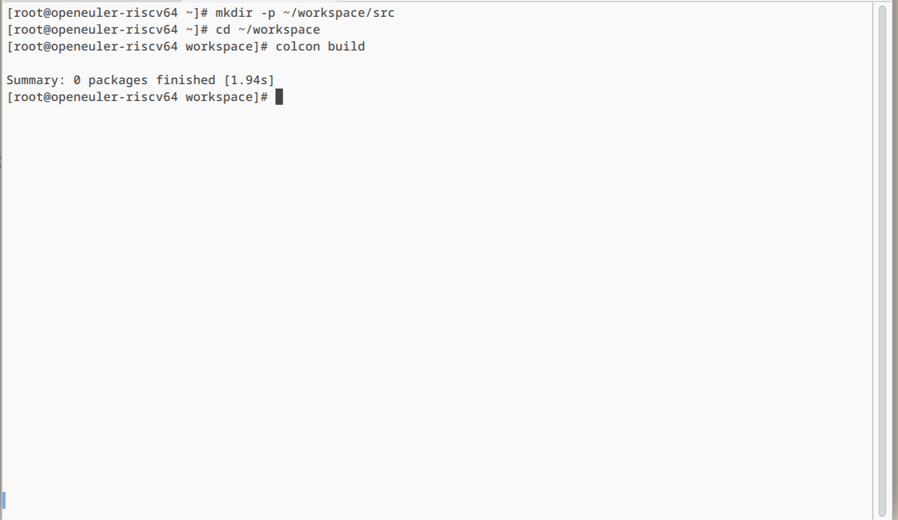

# ROS2 编译环境安装与 service 通信

## 安装 colcon 编译工具

ROS2 的编译工具 `colcon` 目前可以通过 `pip` 进行安装，依次执行下列命令

```bash
# 安装 colcon
pip install colcon-common-extensions
# 新建工作区并切换到此目录
mkdir -p ~/workspace/src
cd ~/workspace
# 测试编译，检查输出
colcon build
ls
```



## 编写一个简单的服务和客户端（C++）

这里使用的示例是一个简单的整数加法系统；一个节点请求两个整数的和，另一个节点返回结果。

### 1 创建一个包

首先记得

```bash
source /opt/ros/humble/setup.sh
```

创建 ros2_ws 目录，进入“ros2_ws/src”并创建一个新的包：

```bash
mkdir -p ros2_ws/src
cd ros2_ws/src
ros2 pkg create --build-type ament_cmake cpp_srvcli --dependencies rclcpp example_interfaces
```

#### 1.1 更新 package.xml
因为您在包创建过程中使用了“--dependencies”选项，所以无需手动添加依赖项到“package.xml”或“CMakeLists.txt”中。

同样，确保将描述、维护者电子邮件和姓名以及许可证信息添加到 package.xml 中。

```xml
<description>C++ client server tutorial</description>
<maintainer email="you@email.com">Your Name</maintainer>
<license>Apache License 2.0</license>
```

### 2 编写服务节点
在``ros2_ws/src/cpp_srvcli/src``目录中，创建一个名为``add_two_ints_server.cpp``的新文件，并粘贴以下代码：

```cpp
#include "rclcpp/rclcpp.hpp"
#include "example_interfaces/srv/add_two_ints.hpp"

#include <memory>

void add(const std::shared_ptr<example_interfaces::srv::AddTwoInts::Request> request,
          std::shared_ptr<example_interfaces::srv::AddTwoInts::Response>      response)
{
  response->sum = request->a + request->b;
  RCLCPP_INFO(rclcpp::get_logger("rclcpp"), "Incoming request\na: %ld" " b: %ld",
                request->a, request->b);
  RCLCPP_INFO(rclcpp::get_logger("rclcpp"), "sending back response: [%ld]", (long int)response->sum);
}

int main(int argc, char **argv)
{
  rclcpp::init(argc, argv);

  std::shared_ptr<rclcpp::Node> node = rclcpp::Node::make_shared("add_two_ints_server");

  rclcpp::Service<example_interfaces::srv::AddTwoInts>::SharedPtr service =
    node->create_service<example_interfaces::srv::AddTwoInts>("add_two_ints", &add);

  RCLCPP_INFO(rclcpp::get_logger("rclcpp"), "Ready to add two ints.");

  rclcpp::spin(node);
  rclcpp::shutdown();
}
```

### 3.编写客户端节点
在``ros2_ws/src/cpp_srvcli/src``目录中，创建一个名为``add_two_ints_client.cpp``的新文件，并将以下代码粘贴到其中：

```cpp
#include "rclcpp/rclcpp.hpp"
#include "example_interfaces/srv/add_two_ints.hpp"

#include <chrono>
#include <cstdlib>
#include <memory>

using namespace std::chrono_literals;

int main(int argc, char **argv)
{
  rclcpp::init(argc, argv);

  if (argc != 3) {
      RCLCPP_INFO(rclcpp::get_logger("rclcpp"), "usage: add_two_ints_client X Y");
      return 1;
  }

  std::shared_ptr<rclcpp::Node> node = rclcpp::Node::make_shared("add_two_ints_client");
  rclcpp::Client<example_interfaces::srv::AddTwoInts>::SharedPtr client =
    node->create_client<example_interfaces::srv::AddTwoInts>("add_two_ints");

  auto request = std::make_shared<example_interfaces::srv::AddTwoInts::Request>();
  request->a = atoll(argv[1]);
  request->b = atoll(argv[2]);

  while (!client->wait_for_service(1s)) {
    if (!rclcpp::ok()) {
      RCLCPP_ERROR(rclcpp::get_logger("rclcpp"), "Interrupted while waiting for the service. Exiting.");
      return 0;
    }
    RCLCPP_INFO(rclcpp::get_logger("rclcpp"), "service not available, waiting again...");
  }

  auto result = client->async_send_request(request);
  // Wait for the result.
  if (rclcpp::spin_until_future_complete(node, result) ==
    rclcpp::FutureReturnCode::SUCCESS)
  {
    RCLCPP_INFO(rclcpp::get_logger("rclcpp"), "Sum: %ld", result.get()->sum);
  } else {
    RCLCPP_ERROR(rclcpp::get_logger("rclcpp"), "Failed to call service add_two_ints");
  }

  rclcpp::shutdown();
  return 0;
}
```

### 4 添加可执行文件
返回到``CMakeLists.txt``，为新节点添加可执行文件和目标。在自动生成的文件中删除一些不必要的样板代码后，你的``CMakeLists.txt``应该如下所示：
```cmake
cmake_minimum_required(VERSION 3.5)
project(cpp_srvcli)

find_package(ament_cmake REQUIRED)
find_package(rclcpp REQUIRED)
find_package(example_interfaces REQUIRED)

add_executable(server src/add_two_ints_server.cpp)
ament_target_dependencies(server rclcpp example_interfaces)

add_executable(client src/add_two_ints_client.cpp)
ament_target_dependencies(client rclcpp example_interfaces)

install(TARGETS
  server
  client
  DESTINATION lib/${PROJECT_NAME})

ament_package()
```

### 5 构建和运行

目前 rosdep 不支持 openEuler 系统，在安装过经过前三篇文章提到的 ROS2 软件包后，需要额外安装一个包：

```bash
dnf install ros-humble-example-interfaces
```

返回到您的工作空间的根目录 ros2_ws，并构建您的新包：

```bash
colcon build --packages-select cpp_srvcli
```

加载设置文件：

```bash
source install/setup.bash
```
现在运行服务节点：

```bash
ros2 run cpp_srvcli server
```

终端应该返回以下消息，然后等待：

```bash
[INFO] [rclcpp]: Ready to add two ints.
```

打开另一个终端，加载 ROS 环境，并加载设置文件。启动客户端节点，然后输入两个整数，用空格分隔：

```bash
source /opt/ros/humble/setup.sh
source install/setup.bash
ros2 run cpp_srvcli client 2 3
```

例如，如果你选择了``2``和``3``，客户端将会收到如下响应：

```bash
[INFO] [rclcpp]: Sum: 5
```

返回运行服务节点的终端。您将看到当服务节点收到请求、接收到的数据以及发送回的响应时，它会发布日志消息：

```bash
[INFO] [rclcpp]: Incoming request
a: 2 b: 3
[INFO] [rclcpp]: sending back response: [5]
```

在服务器终端中输入``Ctrl+C``以停止节点的运行。

以上，您创建了两个节点来请求和响应服务数据。您将它们的依赖项和可执行文件添加到软件包配置文件中，以便能够构建和运行它们，并看到服务/客户端系统的工作情况。

参考：http://fishros.org/doc/ros2/humble/Tutorials/Beginner-Client-Libraries/Writing-A-Simple-Cpp-Service-And-Client.html