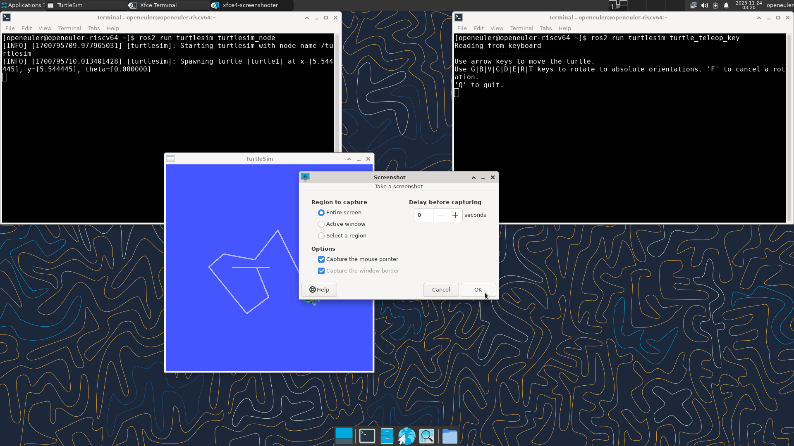
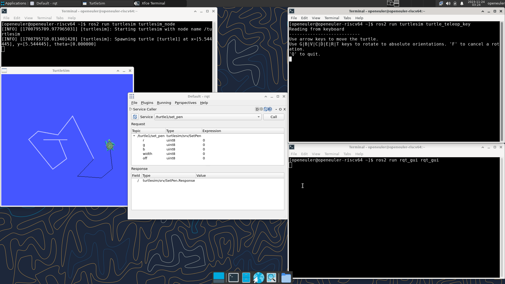

# ROS2 使用入门

在配置完 openEuler RISC-V 上的 ROS2 软件源之后，我们就可以下载所需软件包并运行 ROS2 程序了。以下以 ROS 经典的小乌龟为例，演示 ROS 程序的运行。

## 安装所需软件包

想要运行 ROS 小乌龟示例，需要安装一组 ROS 的基础软件包 ros-base，以及小乌龟：

```bash
dnf install ros-humble-ros-base ros-humble-turtlesim
```

安装上述软件后，打开终端引入 ROS 环境：

```bash
source /opt/ros/humble/setup.sh
```

## 运行 turtlesim

分别在两个终端执行 `ros2 run turtlesim turtlesim_node` 和 `ros2 run turtlesim turtle_teleop_key` 可见图形界面弹出，且可在终端控制，测试通过



## 运行 rqt 改变画笔颜色

在 turtlesim 的基础上打开一个新终端，执行 `ros2 run rqt_gui rqt_gui`

通过 Plugins > Services > Service Caller 添加界面

service 中选择 /turtle1/set_pen 并点击 Call，然后利用键盘在终端移动小海龟时，其走过的路径为黑色。


